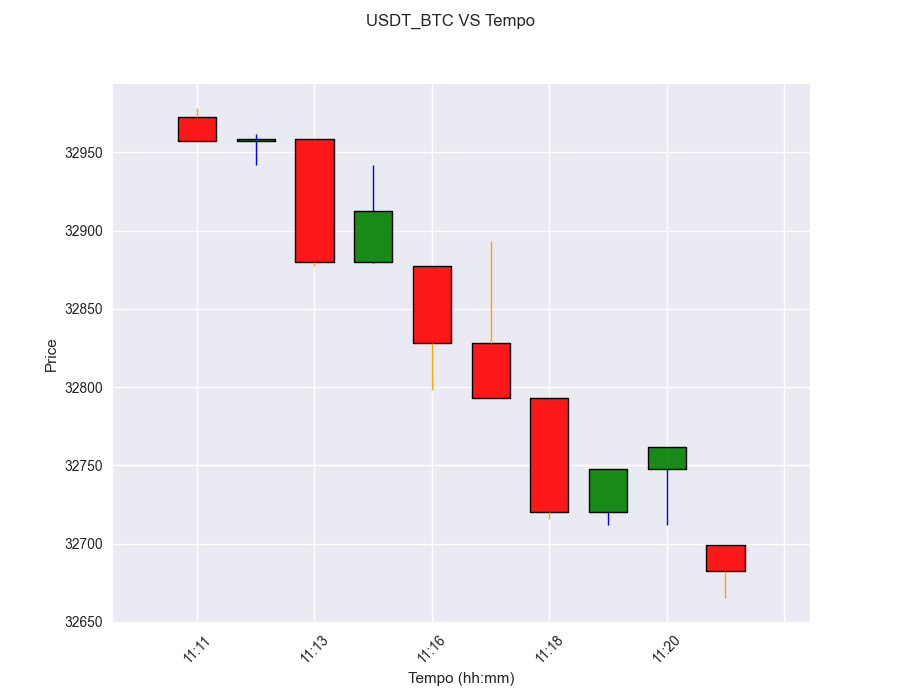

# Smartt Graph

## Para que serve essa aplicação?
  - Serve para coletar candlesticks a partir da [Poloniex Public API](https://docs.poloniex.com/#introduction) e salva-los no banco
  - São guardados os candles de 1, 5 e 10 mins respectivamentes
  - Monitorar os candlesticks salvos 
  - Também é possivel monitorar via grafico os ultimos 10 candlesticks salvos

## O que é necessário para rodar nossa aplicação?
Você pode rodar localmente ou via Docker.
  - Local
    - Python 3+
    - pip
    - MySQL
  - Docker
    - Docker-compose ( *Configuração padrão )

## Como começar?
  ### Ambiente local
  - Instale as dependências do projeto executando o comando `$ pip install -r src/requirements.txt` na raiz do projeto
  - No arquivo `src/app/tick_model.py`, coloque os dados do banco de dados a ser utilizado. Por padrão a aplicação foi criada utilizando o MySQL.
  
  ```
    mydb = mysql.connector.connect(
    host="endereço",
    user="nome do usuário do banco",
    password="senha",
    database="tabela"
    )
  ```
  - Para utilizar a aplicação, faça a importação da função `start()` do arquivo `src/app/index.py` para o arquivo que desejar.
  - Importada a função, faça uma chamada com uma lista das moedas a serem monitoradas. Só é aceito uma lista como parâmetro, mesmo que queira monitorar somente uma moeda. Você pode verificar quais moedas podem ser utilizadas [aqui](https://docs.poloniex.com/#currency-pair-ids)
  
  ```
    start(['USDT_BTC', 'USDT_BTC'])
  ```
  
  - Execute o arquivo e o monitoramento será iniciado

  ```
  ['USDT_DOGE', 'USDT_BTC']

  Monitoramento iniciado

  Currency      Frequency  Datetime                     Open        Low          High         Close
  ----------  -----------  -------------------  ------------  ---------  ------------  ------------
  USDT_DOGE             1  2021-06-21 11:16:26      0.227102      0.226      0.227102      0.227102
  USDT_BTC              1  2021-06-21 11:16:26  32877.4       32798.4    32877.4       32828.1
  
  ```

  ### Grafico em tempo real
  
  *Obs: só é possivel utilizar o grafico localmente*
  - Para vizualizar o grafico em tempo real, faça a importação da função `live_graph_plot()` do arquivo `src/app/tick_service.py` para o arquivo que desejar.
  - Passe dois parâmetros: a moeda a ser monitorada e a frequencia dos candlesticks
  
  ```
    live_graph_plot('USDT_BTC', 1)
  ```
  - Certifique-se que o arquivo com o `start()` esteja sendo executado
  - Execute o arquivo e uma janela com o gráfico aparecerá
  
  


  ### Docker
  - Certifique de ter instalado o Docker e o Docker-compose
  - Vá no arquivo `monitoramento.py` e passe uma lista das moedas a serem monitoradas. Só é aceito uma lista como parâmetro, mesmo que queira monitorar somente uma moeda. Você pode verificar quais moedas podem ser utilizadas [aqui](https://docs.poloniex.com/#currency-pair-ids)
  - Certifique-se que o arquivo `src/app/tick_model.py` esteja com a seguinte configuração
  
  ```
    mydb = mysql.connector.connect(
    host="cryptocurrency-quotation_db_1",
    user="root",
    password="smartt",
    database="smartt-graph"
    )
  ```
  - Na pasta raiz do projeto execute o comando `$ docker-compose up -d`
  - Após terminada a execução, os containers serão iniciados e a coleta dos dados será executada enquanto os containers estiverem sendo executados
  - Caso queira alterar as moedas a serem coletadas
    - altere o arquivo `monitoramento.py` para as moedas desejadas
    - rode o comando `$ docker stop cryptocurrency-quotation_python_1`
    - rode o comando `$ docker-compose build` na raiz do projeto
    - rode o comando `$ docker start cryptocurrency-quotation_python_1`

## Rodandos os testes
  - rode o comando `$ python -m pytest` na raiz do projeto


## Principais desafios
  - Entender o fluxo da linguagem python
  - Entender o uso de threads e como finaliza-las
  - Executar arquivos de outras pastas
  - Criar os teste
  - Entender o Docker e como subir os containers utilizando o docker-compose

## Pontos a melhorar
 - Organizar os arquivos em pastas: esse foi um desafio que ainda não foi possivel superar e que impactou muito na criação dos testes, pois sempre dava problema de ModuleNotFoundError ao executar os testes. Por isso que todos os arquivos `.py` ficaram na mesma pasta
 - Entender melhor os mocks e melhorar a cobertura de testes
 - Diminuir a responsabilidade de algumas funções que estão ferindo o principio S do SOLID
 - Criar um sistema de monitoramento em tempo real com a criação de uma API com Flask e o Socket.IO